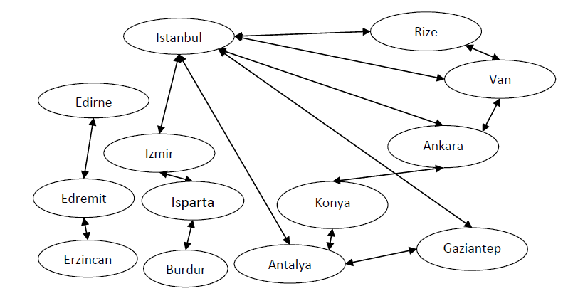

# Flight-Planner

### Description

This code provides all path between two cities and finds shortest route.

### Usage
```
route(X,Y) – "a route between X and Y exists”.
sroute(X,Y,Z) - "if a route exists between X and Y and if so, provides the shortest route".
```

### Possible Flights


### Contact
osenturk@gtu.edu.tr

### License
[Apache License 2.0](https://choosealicense.com/licenses/apache-2.0/)


